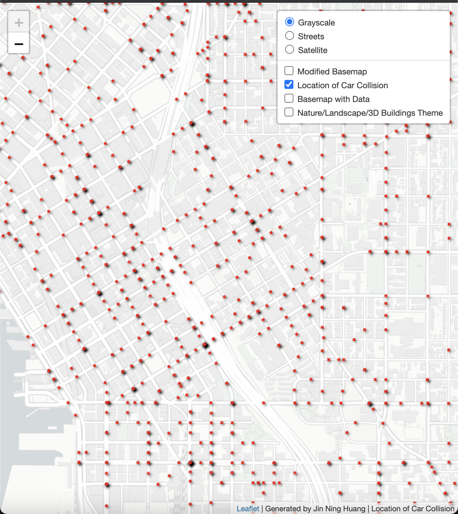

# Car Collision in Seattle (2020)

### This is an assignment for UW GEOG 458 - Lab 4: Map Design and Tile Generation

**This Repo contains:**
* Main html file for map display
* Image folder for map tiles result
* Assets folder for tile photo

[Link](https://jinh48.github.io/car-collision-2020/index.html) for the interactive map page. 
____________________________________________________________________________________________________________________________________________________________________

## Introduction and Credits:

The map simply displays the geospatial location of the car collision in Seattle, Washington during 2020 time stamp. Below will shows all the screenshot of the tile layers with brief descriptions. Please note that the tiles are only covering the Seattle area as the location is the main focus. I wasn't able to increase the tile level (in another word, to allow to zoom in more closely) due to the massive amount of time for the machine to generate over 30,000 tiles. The highest level I tried was at 17th, and noticed that the labeling and dots were still shrinking as I zoomed in. I figure it wasn't worth the view and the huge amount of time of waiting.   

I would like to thanks UW Professor Bo Zhao and his team for creating this lab for educational purpose. I also would like to credit the Github user [ppete2](https://github.com/ppete2/Leaflet.PolylineMeasure) for using the Leaflet plug-in. 

## Tile 1 - Modified Basemap

* Examined georaphic area: Within Seattle, WA
* Zoom levels: Min: 11, Max: 15
* Brief description: This tile will mainly focus on the road networks, thus, getting different colors of roads and make them more brighter to see easily againist the black backgroud. Each color representing the different type of the roads (highways, major roads, etc.) 

## Tile 2 - Data

* Examined georaphic area: Within Seattle, WA
* Zoom levels: Min: 11, Max: 15
* Brief description: 
