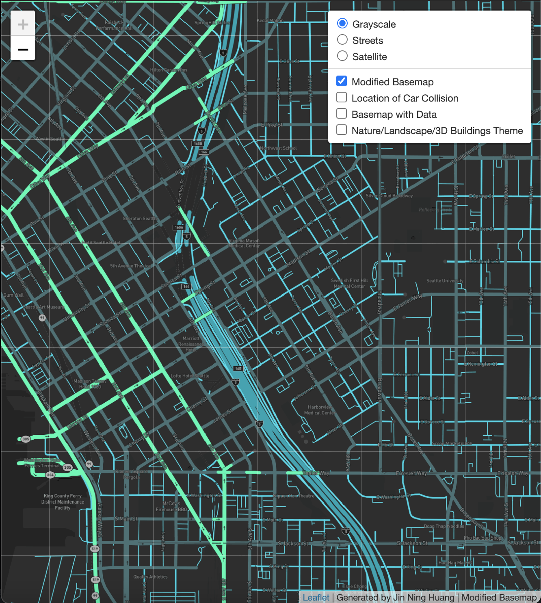

# Car Collision in Seattle (2020)

### This is an assignment for UW GEOG 458 - Lab 4: Map Design and Tile Generation

**This Repo contains:**
* Main html file for map display
* Image folder for map tiles result
* Assets folder for tile photo

[Link](https://jinh48.github.io/car-collision-2020/index.html) for the interactive map page. 
____________________________________________________________________________________________________________________________________________________________________

## Introduction and Credits:

The map simply display the geospatial location of the generalize car collision in Seattle, Washington during 2020 time stamp. Below will shows all the screenshot of the tile layers with brief descriptions. 

I would like to thanks UW Professor Bo Zhao and his team for creating this lab for educational purpose. I also would like to credit the Github user [ppete2](https://github.com/ppete2/Leaflet.PolylineMeasure) for using the Leaflet plug-in. 

## Tile 1 - Modified Basemap

* Examined georaphic area: Within Seattle, WA
* Zoom levels: Min: 11, Max: 15
* Brief description: This tile will mainly focus on the road networks, thus, getting different colors of roads and make them more brighter to see easily againist the black backgroud. Each color representing the different type of the roads (highways, major roads, etc.) 
